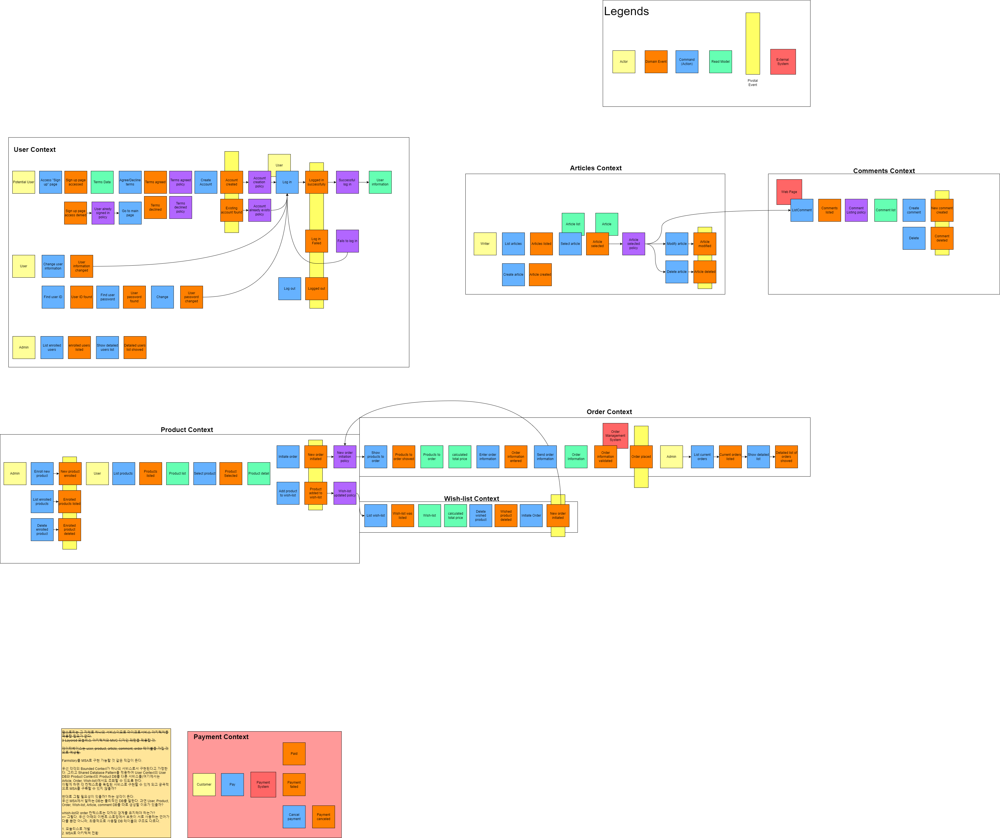
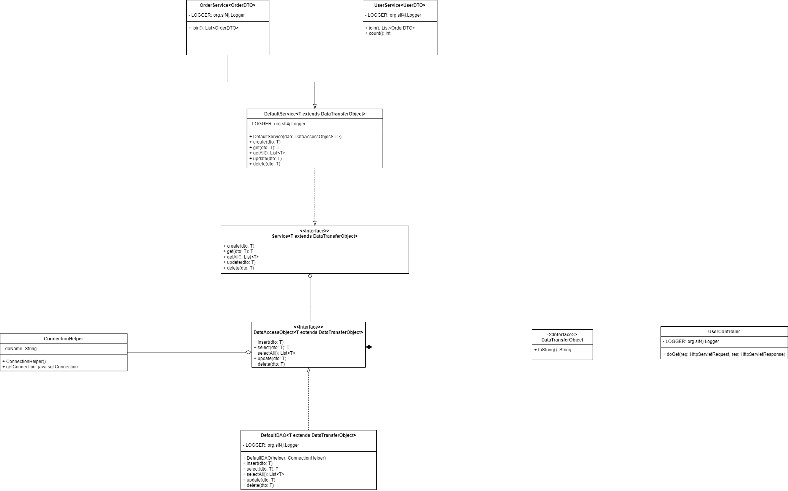

# 필독!!!!!

## 1. 브랜치 전략

브랜치 전략으로는 **Github Flow**를 사용한다. 주 브랜치로 `master`브랜치를 사용하고 팀원들은 로컬 저장소에서 `feature/팀원아이디` 브랜치를 생성한다.
코드를 변경할 때에는 **반드시** `feature/팀원아이디` 브랜치를 이용하고, 모든 변경이 끝나면 이를 `push`하고 `merge` 한다.

## 2. Software Design Diagrams

### 2.1 EventStroming

### 2.2 C4 Model - System

### 2.3 C4 Model - Container

### 2.4 C4 Model - Container

### 2.5 UML Diagram

